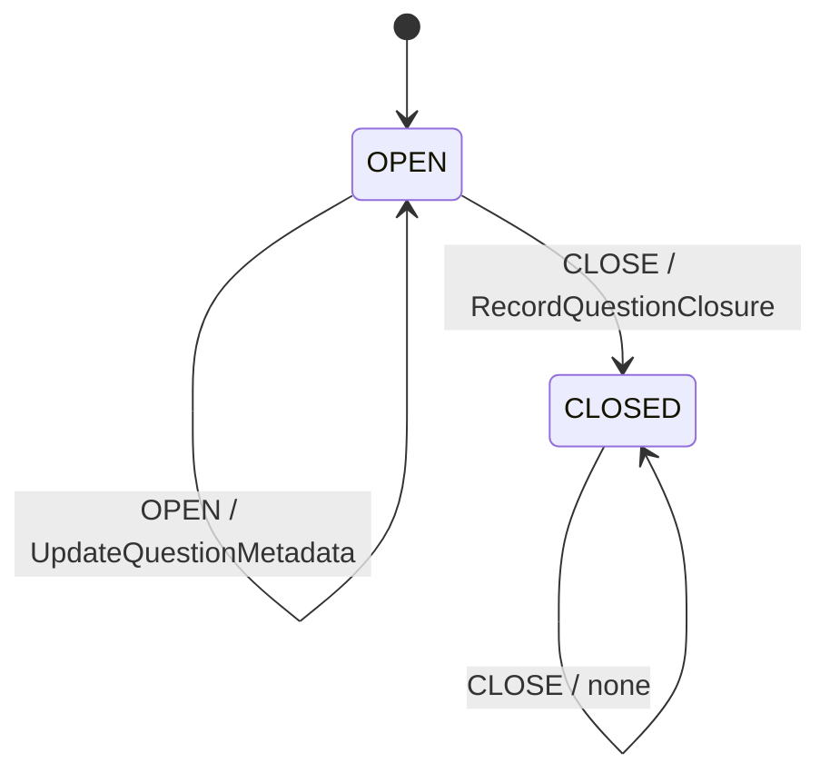

# Frontier Question FSM

> Generated view. Authoritative source: `docs/data/frontier_question_fsm.v1.json`.
> Regenerate with `python scripts/render_frontier_question_fsm.py`.

## Transition table

| From | Event | To | Transition | Effects |
|---|---|---|---|---|
| `OPEN` | `OPEN` | `OPEN` | `refresh-open` | UpdateQuestionMetadata |
| `OPEN` | `CLOSE` | `CLOSED` | `close` | RecordQuestionClosure |
| `CLOSED` | `CLOSE` | `CLOSED` | `duplicate-close` | none |

Unlisted state/event pairs are rejected without state change. In particular, `CLOSED + OPEN`
is invalid. `CLOSED` is intentionally atomic rather than final so duplicate `CLOSE` has an
explicit idempotent self-loop.

## State diagram



## Properties

Safety:

- `closed-does-not-reopen`: A CLOSED question cannot return to OPEN through the OPEN command.
- `close-is-idempotent`: Repeated CLOSE commands do not increment visits or append closure/history events.

Liveness:

- `eventual-close`: An OPEN question reaches CLOSED when a CLOSE command is delivered.

## Verification

```bash
python /path/to/fsm-design/scripts/validate_fsm.py docs/data/frontier_question_fsm.v1.json
python /path/to/fsm-design/scripts/run_fsm_traces.py docs/data/frontier_question_fsm.v1.json docs/data/frontier_question_fsm.traces.json
pytest -q tests/test_state_isolation_fsm_20260728.py
python ooptdd_receipts/run_all.py
```
