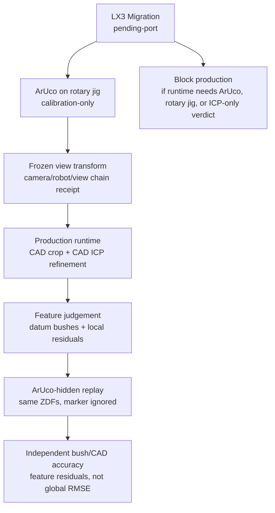

# LX3 Rotary Jig Removal LakatoTree Branch

Date: 2026-06-24

## Claim

LX3 can remove the rotary-jig ArUco dependency from production. The strong
rotary-jig registration evidence should be treated as a frozen calibration
receipt. After jig removal, production may run CAD ICP refinement, but ICP must
not be the only verdict. Local bush/bolt feature residuals remain the
conformance evidence.

## Branch

## Acceptance Gates

| Gate | Required Evidence | Fail Condition |
|---|---|---|
| G1 frozen calibration receipt | transform source, date, fixture state, residuals | no receipt or mutable runtime solve |
| G2 runtime dependency audit | production dependency list contains frozen transform, CAD crop, CAD ICP refinement, feature residuals, robot pose, or part datum | dependency contains ArUco, fiducial, rotary jig, turntable, marker ROI, free global ICP, or ICP-only verdict |
| G3 ArUco-hidden replay | existing LX3 ZDF replay with marker observations ignored | extractor rejects for missing markers |
| G4 two-stage crop | loose CAD crop around `D=25..40mm`, leakage/loss stats, feature ROI coverage | destructive honeycomb crop or fixture leakage without numeric audit |
| G5 CAD ICP refinement | jig removed; CAD ICP initialized from frozen/CAD path | unconstrained free ICP or best-fit-only pass |
| G6 independent accuracy | bush/CMM or bush/CAD feature residuals and p95, separated from rigid RMSE | precision-only evidence claimed as accuracy |

## Longinus

- Do not call ArUco repeatability part accuracy.
- Do not call rotary-jig coordinates production datum.
- Do use the excellent rotary-jig registration as a calibration receipt, not as
  runtime hardware dependency.
- Do not let `measured_z == cad_z` style fallbacks reappear under a new name.
- Do not use global CAD RMSE to hide bad local bush or bolt residuals.
- Do not call CAD ICP green unless the same result exposes local feature
  residuals and p95.
- Do not promote LX3 while 12 bolt nominals remain placeholders.

## Next Action Board

Use `docs/LX3_NEXT_ACTION_BOARD_20260625.md` as the current operating board.

Current reading:

- Precision recovered: `0.993mm`.
- Jig-removed crop is visually recovered, especially around `D=25..40mm`.
- CMM references are available.
- Mounting-bush CMM comparison is promising, but the replayable feature residual
  table is still the next gate.
- CAD/global accuracy remains open until feature residuals close it.

## PrismV2 Binding

- `prism_core/domain/lx3_subframe.py`
  - `assert_lx3_production_spec_ready`
  - `assert_lx3_production_runtime_ready`
- `tests/prism_core/test_lx3_production_spec_gate.py`
- `infra/lakatotree/prismv2_manifest.json`

The production runtime dependency list must be explicit. If it still names
`aruco`, `fiducial`, `marker_roi`, `rotary_jig`, `rotating_jig`, `turntable`,
`zdf_aruco_extractor`, `free_global_icp`, `global_rmse_only`,
`icp_only_verdict`, or `bestfit_only`, LX3 stays `pending-port`.
