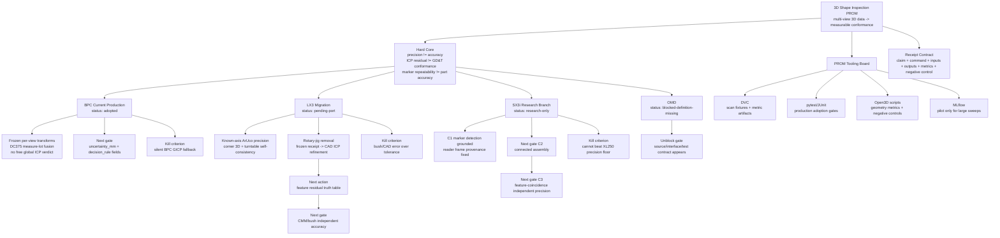

# Three-D PROM LakatoTree Map

Date: 2026-06-24

This is the human-readable map for the current 3D PROM tree. The existing
generated dashboard `three_d_detection.html` visualizes the broader 3D detection
tree. This map focuses on the active PROM operating board: BPC, LX3, SX3i,
OMD, tooling, and promotion gates.

## Current Answer

Yes, LakatoTree already has tree/graph rendering support:

- `three_d_detection.html`: static offline HTML dashboard.
- `three_d_detection.dot`: Graphviz DOT source.
- `server/graph_view.py`: JSON -> DOT -> browser-view rendering helpers.
- `examples/three_d_dashboard.py`: regenerates the static 3D dashboard.
- `docs/THREE_D_PROM_LAKATOTREE_MAP_20260624.html`: static offline PROM map.

What was missing was a compact PROM map for the new BPC/LX3/SX3i/OMD operating
protocol. This document is that map.

## PROM Tree



## Status Legend

| Status | Meaning |
|---|---|
| adopted | production path exists, tests pass, receipts are replayable |
| progressive | pre-registered metric improved with receipts |
| pending-port | research branch is useful, production port incomplete |
| reference | diagnostic or background branch |
| research-only | useful but not production-ready |
| blocked | definition, source, data, or dependency missing |
| rejected | negative control or independent check falsified the claim |

## Branch Board

| Branch | Status | Best Current Evidence | Next Gate | Do Not Claim Yet |
|---|---|---|---|---|
| BPC | adopted | frozen per-view measure-lot path, production tests | uncertainty and decision-rule fields | free GICP is normal production path |
| LX3 | pending-port | precision recovered to 0.993mm, jig-removed crop improved, CMM references available, mounting-bush CMM result promising | feature residual truth table, crop leakage/loss stats, then CMM/bush accuracy closure | ArUco, CAD ICP RMSE, or a pretty jig-removed cloud alone proves part accuracy |
| SX3i | research-only | reader fix and C1 marker detection | C2 assembly, then C3 feature coincidence | C1 detection proves sub-0.1mm accuracy |
| OMD | blocked | none | source/interface/test contract | any measurement claim |

## Existing Visual Assets

Use these when a visual tree is needed:

```sh
python -m examples.three_d_dashboard
dot -Tsvg three_d_detection.dot -o three_d_detection.svg
```

The HTML dashboard is offline and dependency-free. The DOT output can be
rendered with Graphviz or embedded in other viewers.

For the PROM-specific operator map, open:

```text
docs/THREE_D_PROM_LAKATOTREE_MAP_20260624.html
```

## Better Map Direction

The next useful map is an auto-generated `prom_map.dot`/`prom_map.html` from a
single JSON board, so branch status cannot drift across docs. Until then, this
file is the compact operator map and `THREE_D_PROM_PROTOCOL_20260624.md` remains
the governing protocol.

## Source Files

- `docs/THREE_D_PROM_PROTOCOL_20260624.md`
- `docs/THREE_D_PROM_OPEN_SOURCE_TOOLING_20260624.md`
- `docs/THREE_D_INSPECTION_BACKGROUND_KNOWLEDGE_20260624.md`
- `docs/LX3_ROTARY_JIG_REMOVAL_LAKATOTREE_20260624.md`
- `docs/LX3_NEXT_ACTION_BOARD_20260625.md`
- `examples/three_d_dashboard.py`
- `server/graph_view.py`
- `three_d_detection.html`
- `three_d_detection.dot`
- `docs/THREE_D_PROM_LAKATOTREE_MAP_20260624.html`
